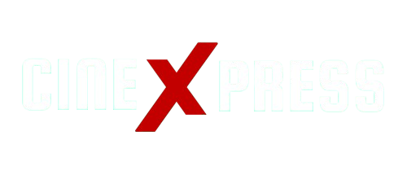

<p align="center">
  
</p>

# Movie Ticket Booking System (MERN Stack)

---

## 🚀 Project Overview

A modern, responsive **Movie Ticket Booking System** built on the MERN stack, designed to deliver an intuitive and seamless user experience. Whether you're a movie buff looking for the next blockbuster or an admin setting up shows, this application has you covered:

- **Users** can browse new releases, watch trailers, view cast & details, select showtimes & seats, and complete payments.
- **Admin** can fetch & curate movies from TMDB, schedule shows, adjust ticket pricing, and monitor bookings—all via a secure admin panel.

---

## 🔥 Key Features

- **Authentication & Security**

  - User sign-up & sign-in powered by **Clerk**
  - Role-based access control for an Admin/Superuser panel

- **Rich Movie Data**

  - Automatic fetching of movie metadata (titles, posters, trailers, cast) via **TMDB API**
  - Admin selection to determine which movies appear on the platform

- **Show & Ticket Management**

  - Admin can create shows (dates, times, pricing)
  - Visual, interactive seat map for users to select preferred seats
  - Real-time seat availability tracking

- **Seamless Payments & Notifications**

  - Secure checkout flow integrated with **Stripe**
  - Transactional email notifications (booking confirmation, e-tickets) via **Brevo**

- **Background Task Processing**

  - Scheduled & queued jobs (e.g., email dispatch, cleanup) managed by **Inngest**

- **Responsive & Stylish UI**

  - Tailwind CSS for a modern, mobile-first design
  - Fluid seat-map component with clear UX feedback

---

## 📦 Tech Stack & Services

| Layer           | Technology/Service          | Purpose                                  |
| --------------- | --------------------------- | ---------------------------------------- |
| Frontend        | React, Tailwind CSS         | Responsive UI & component architecture   |
| Backend         | Node.js, Express            | RESTful API, business logic              |
| Authentication  | Clerk                       | Secure user & role management            |
| Database        | MongoDB Atlas               | Document storage & quick retrieval       |
| Background Jobs | Inngest                     | Scalable, reliable background processing |
| Payments        | Stripe                      | PCI-compliant payment gateway            |
| Email Service   | Brevo (formerly Sendinblue) | Automated transactional emails           |
| External Data   | TMDB API                    | Movie metadata & media                   |

---

## 🎬 Live Demo

> **[CineXpress](https://cinexpress-three.vercel.app/)**

---

## 🛠️ Installation & Setup

1. **Clone the repository**

   ```bash
   git clone https://github.com/rishabhhhhhhhhhhh/Movie-Ticket-Booking-System.git
   cd Movie-Ticket-Booking-System
   ```

2. **Install dependencies**

   ```bash
   npm install
   cd client && npm install
   ```

3. **Environment Variables**

   Copy `.env.example` to `.env` in both `/server` & `/client` directories and fill in:

   ### Server `.env`

   ```env
   MONGODB_URI=your_mongodb_connection_string

   CLERK_PUBLISHABLE_KEY=your_clerk_publishable_key
   CLERK_SECRET_KEY=your_clerk_secret_key

   INNGEST_EVENT_KEY=your_inngest_event_key
   INNGEST_SIGNING_KEY=your_inngest_signing_key

   TMDB_API_KEY=your_tmdb_api_key

   STRIPE_PUBLISHABLE_KEY=your_stripe_publishable_key
   STRIPE_SECRET_KEY=your_stripe_secret_key
   STRIPE_WEBHOOK_KEY=your_stripe_webhook_key

   SENDER_EMAIL=your_sender_email
   SMTP_USER=your_smtp_user
   SMTP_PASS=your_smtp_password
   ```

   ### Client `.env`

   ```env
   VITE_CURRENCY='$'
   VITE_CLERK_PUBLISHABLE_KEY=your_clerk_publishable_key
   VITE_BASE_URL=your_backend_url
   VITE_TMDB_IMAGE_BASE_URL=https://image.tmdb.org/t/p/original
   ```

4. **Run the app**

   ```bash
   # Start backend server
   npm run dev

   # In a separate terminal, start React frontend
   cd client && npm start
   ```

---

## 🖥️ Admin Panel

### Navigate to `/admin` to access:
   - **Movie Curation**: Auto-fetch & select TMDB titles
   - **Show Management**: Schedule dates, times & pricing
   - **Booking Dashboard**: Monitor orders & user data

---

## 📂 Project Structure

Below is the directory layout of the project:

### Client Structure
```
client/
├── public/                 # Static files
│   ├── backgroundImage.png
│   ├── bg.png
│   ├── logo.png
│   └── ...
├── src/
│   ├── assets/            # Assets and dummy data
│   ├── components/        # Reusable components
│   ├── context/          # Context providers
│   ├── lib/              # Utility functions
│   ├── pages/            # Page components
│   │   ├── admin/        # Admin panel pages
│   │   └── ...          # Other pages
│   ├── App.jsx           # Main app component
│   └── main.jsx          # Entry point
├── .env                   # Environment variables
├── index.html            # HTML template
├── package.json          # Dependencies
└── vite.config.js        # Vite configuration
```

### Server Structure
```
server/
├── configs/              # Configuration files
│   ├── db.js            # Database configuration
│   └── nodeMailer.js    # Email service setup
├── controllers/         # Route controllers
│   ├── adminController.js
│   ├── bookingController.js
│   ├── showController.js
│   └── userController.js
├── inngest/            # Background job handlers
├── middleware/         # Express middleware
│   └── auth.js        # Authentication middleware
├── models/            # MongoDB schemas
│   ├── Bookings.js
│   ├── Movies.js
│   ├── Show.js
│   └── Users.js
├── routes/           # API routes
│   ├── adminRoutes.js
│   ├── bookingRoutes.js
│   ├── showRoutes.js
│   └── userRoutes.js
├── .env              # Environment variables
├── package.json      # Dependencies
└── server.js         # Entry point
```

---

**Enjoy the show! 🍿**

